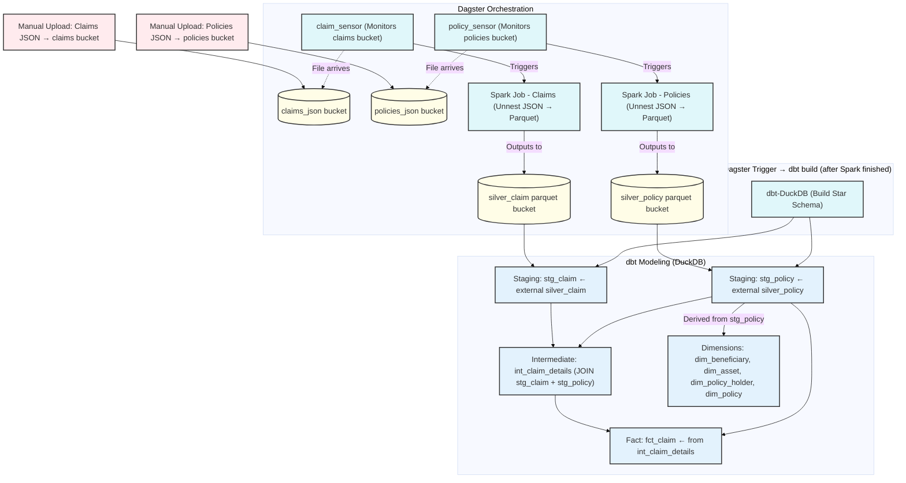

## Data Pipeline Flow

# Prerequisites:
* Docker
* Python
* WSL (for windows)
* DuckDB

# Instructions
* Spin everything up - docker compose up -d
* Go to minio http://localhost:9000 and see if "raw-data", "silver", and "dagster-pipes-metadata" are created
  - "raw-data" is for the dummy nested json files
  - "silver" is for spark output in parquet files
  - "dagster-pipes-metadata" allows dagster (through dagster-pipes library) to establish communication with spark and display the logs in the dagster UI without having dagster acting as a spark driver
* Go to Dagster UI http://localhost:3000
* Go to "sensor" page and activate both sensors
* Generate "claim" and "policy" files and put them into "raw-data" bucket -> python3 data_gen/generate_data.py (this will trigger the sensors)
* If both sensors are triggered and each kicking off the spark job, monitor the dags of both jobs from the Dagster UI
* Fire up duckdb from the terminal to query the tables
  - duckdb storage/insurance_analytics.db
  - Set aws (minio) credentials
  - SELECT ...

